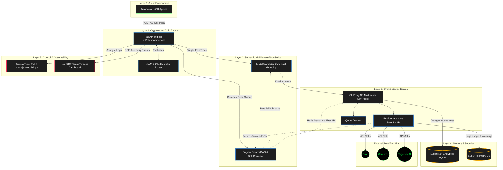

```mermaid
graph TD
    %% Styling
    classDef client fill:#1e1e1e,stroke:#00FF41,stroke-width:2px,color:#fff
    classDef python fill:#1e1e1e,stroke:#3776AB,stroke-width:2px,color:#fff
    classDef ts fill:#1e1e1e,stroke:#3178C6,stroke-width:2px,color:#fff
    classDef db fill:#1e1e1e,stroke:#FFB000,stroke-width:2px,color:#fff
    classDef ui fill:#1e1e1e,stroke:#FF003C,stroke-width:2px,color:#fff
    classDef cloud fill:#000,stroke:#00FF41,stroke-width:1px,color:#00FF41,stroke-dasharray: 5 5

    %% Layer 0
    subgraph Layer_0 [Layer 0: Client Environment]
        Agents[Autonomous CLI Agents]:::client
    end

    %% Layer 1
    subgraph Layer_1 [Layer 1: Governance Brain Python]
        FastAPI[FastAPI Ingress /v1/chat/completions]:::python
        BitNet[vLLM BitNet Heuristic Router]:::python
        FastAPI <-->|Evaluates| BitNet
    end

    %% Layer 2
    subgraph Layer_2 [Layer 2: Semantic Middleware TypeScript]
        ModelTranslator[ModelTranslator Canonical Grouping]:::ts
        Engram[Engram Swarm DAG & Drift Corrector]:::ts
    end

    %% Layer 3
    subgraph Layer_3 [Layer 3: OmniGateway Egress]
        Multiplexer[CLIProxyAPI Multiplexer Key Pooler]:::ts
        Providers[Provider Adapters FreeLLMAPI]:::ts
        QuotaTracker[Quota Tracker]:::ts
        Multiplexer <--> QuotaTracker
        Multiplexer --> Providers
    end

    %% Layer 4
    subgraph Layer_4 [Layer 4: Memory & Security]
        SugarVault[(SugarVault Encrypted SQLite)]:::db
        SugarDB[(Sugar Telemetry DB)]:::db
    end

    %% Layer 5
    subgraph Layer_5 [Layer 5: Control & Observability]
        TUI[Textual/Typer TUI + xterm.js Web Bridge]:::ui
        HoloCRT[Holo-CRT React/Three.js Dashboard]:::ui
    end

    %% Cloud Providers
    subgraph Cloud [External Free-Tier APIs]
        Groq((Groq)):::cloud
        Cerebras((Cerebras)):::cloud
        Together((Together AI)):::cloud
    end

    %% Routing Flow
    Agents -->|POST /v1 Canonical| FastAPI

    FastAPI -->|Config & Logs| TUI
    FastAPI -->|SSE Telemetry Stream| HoloCRT

    FastAPI -->|Simple Fast Track| ModelTranslator
    FastAPI -->|Complex Deep Swarm| Engram

    Engram -->|Parallel Sub-tasks| ModelTranslator
    ModelTranslator -->|Provider Array| Multiplexer

    Multiplexer -->|Decrypts Active Keys| SugarVault
    Providers -->|Logs Usage & Warnings| SugarDB

    Providers -->|API Calls| Groq
    Providers -->|API Calls| Cerebras
    Providers -->|API Calls| Together

    %% Self Healing Loop
    Providers -.->|Returns Broken JSON| Engram
    Engram -.->|Heals Syntax via Fast API| Multiplexer
```