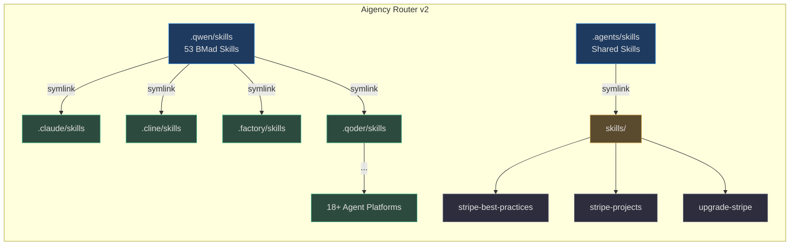
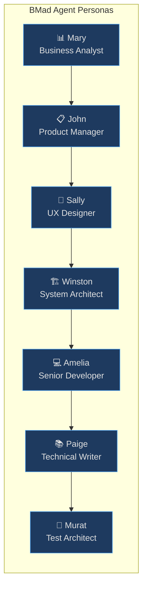

# Aigency Router v2 — Overview

Aigency Router v2 is a **multi-agent AI skill orchestration hub** that distributes, versions, and manages reusable AI agent skills across 18+ coding agent platforms. Built on the BMad (Business Modeler & Developer) framework, it provides a unified skill library with specialized agent personas for product discovery, architecture, development, and quality assurance.

## What It Does

The router acts as a central nervous system for AI agent capabilities:

- **Curates 53+ BMad skills** covering the full software development lifecycle — from PRD creation and UX design to architecture, implementation, testing, and retrospectives
- **Distributes skills to 18+ agent platforms** including Claude, Cline, Goose, Qwen, Roo, Trae, Vibe, Zencoder, and more via a symlink-based model
- **Manages agent personas** with distinct roles (Analyst, PM, Architect, Dev, UX Designer, Tech Writer, Test Architect)
- **Integrates external skill libraries** such as Stripe best-practices with hash-locked versioning
- **Maintains persistent context** via ICM (Intelligent Context Memory) across sessions

## Core Concepts

| Concept | Description |
|---------|-------------|
| **Skill** | A self-contained directory with `SKILL.md` containing instructions, prompts, templates, and workflows for a specific capability (`_bmad/_config/skill-manifest.csv:1`) |
| **Agent Platform** | A coding AI tool (Claude Code, Cline, Goose, etc.) that consumes skills from its own dot-prefixed directory (`config.toml:12`) |
| **BMad Module** | A functional domain: BMM (planning & requirements) or TEA (testing & quality) (`_bmad/bmm/config.yaml:1`, `_bmad/tea/config.yaml:1`) |
| **Agent Persona** | A named, iconified role with specific expertise and communication style (`config.toml:35-70`) |
| **Skill Lock** | A `skills-lock.json` file tracking source, type, and SHA-256 hash for integrity (`skills-lock.json:1`) |

## Repository at a Glance

<!-- Sources: config.toml:1, skills-lock.json:1, _bmad/_config/skill-manifest.csv:1 -->

## Agent Ecosystem

<!-- Sources: config.toml:35-70, _bmad/bmm/config.yaml:1, _bmad/tea/config.yaml:1 -->

## Skill Categories

| Category | Skills | Example |
|----------|--------|---------|
| **Product & Discovery** | 8 | `bmad-create-prd`, `bmad-product-brief`, `bmad-market-research` |
| **Design & UX** | 3 | `bmad-create-ux-design`, `bmad-agent-ux-designer` |
| **Architecture** | 4 | `bmad-create-architecture`, `bmad-check-implementation-readiness` |
| **Development** | 5 | `bmad-dev-story`, `bmad-create-story`, `bmad-quick-dev` |
| **Testing & Quality** | 7 | `bmad-tea`, `bmad-testarch-atdd`, `bmad-testarch-trace` |
| **Project Management** | 5 | `bmad-sprint-planning`, `bmad-sprint-status`, `bmad-retrospective` |
| **Review & Elicitation** | 6 | `bmad-code-review`, `bmad-advanced-elicitation`, `bmad-checkpoint-preview` |
| **External** | 3 | `stripe-best-practices`, `stripe-projects`, `upgrade-stripe` |

## Related Pages

- [Setup](./setup.md) — How to install and configure the router
- [Architecture](../02-deep-dive/architecture/index.md) — Deep dive into system design
- [Skills System](../02-deep-dive/skills-system/index.md) — How skills are structured and distributed
- [Agent Platforms](../02-deep-dive/agent-platforms/index.md) — Full list of supported agents
