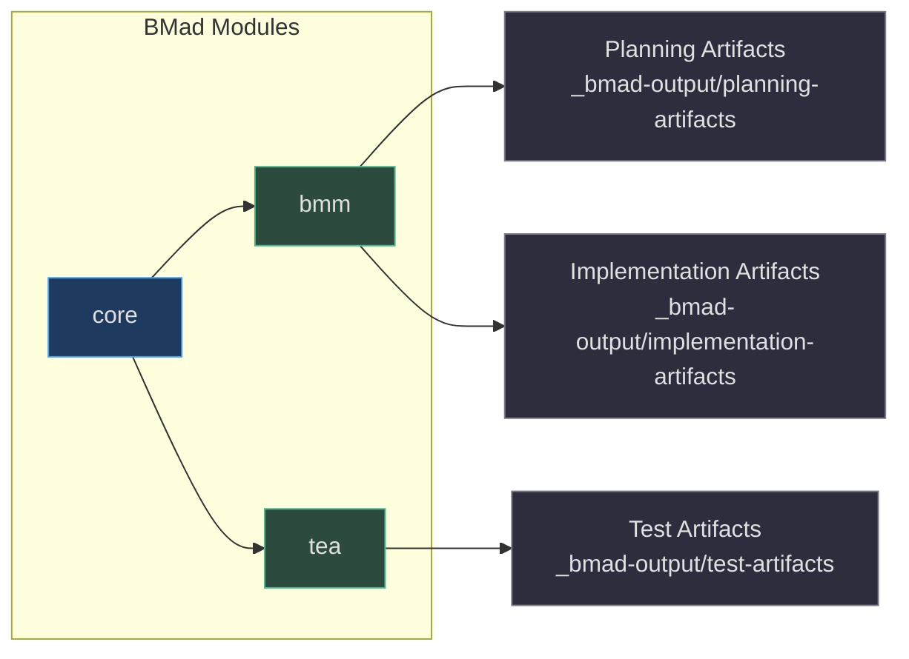

# Quick Reference

## File Locations

| What | Where | Citation |
|------|-------|----------|
| Main config | `_bmad/config.toml` | (`_bmad/config.toml:1`) |
| User overrides | `_bmad/custom/config.user.toml` | (`_bmad/custom/config.user.toml:1`) |
| Skill manifest | `_bmad/_config/skill-manifest.csv` | (`_bmad/_config/skill-manifest.csv:1`) |
| File manifest | `_bmad/_config/files-manifest.csv` | (`_bmad/_config/files-manifest.csv:1`) |
| Skill integrity | `skills-lock.json` | (`skills-lock.json:1`) |
| Agent instructions | `.github/copilot-instructions.md` | (`.github/copilot-instructions.md:1`) |
| Memory rules | `AGENTS.md` | (`AGENTS.md:1`) |

## Common Commands

### BMad Framework

```bash
# View full BMad help
cat _bmad/_config/bmad-help.csv

# Resolve configuration
python _bmad/scripts/resolve_config.py

# Resolve customization overrides
python _bmad/scripts/resolve_customization.py
```

### ICM Memory

```bash
# Recall context before starting work
icm recall "query"
icm recall "query" -t "topic-name"
icm recall-context "query" --limit 5

# Store decisions, errors, preferences
icm store -t decisions-aigency -c "description" -i high
icm store -t errors-resolved -c "description" -i high -k "keyword1,keyword2"
icm store -t preferences -c "description" -i critical
```

### Skill Management

```bash
# Count skills per agent
for d in .agent .agents .cline .claude .qwen; do
  echo "$d: $(find $d/skills -maxdepth 1 -type d | wc -l)"
done

# Verify symlinks
ls -la .claude/skills/ | grep "^l"

# Find a skill across all agents
find . -name "bmad-create-prd" -type d
```

### Git Workflow

```bash
# This repo uses standard git — no special workflow
git status
git add _bmad/_config/skill-manifest.csv
git commit -m "feat: add new skill X"
```

## Agent Personas Quick Lookup

| Name | Role | Module | Icon | Trigger Example |
|------|------|--------|------|-----------------|
| Mary | Business Analyst | BMM | 📊 | "Talk to Mary about requirements" |
| John | Product Manager | BMM | 📋 | "John, create a PRD" |
| Sally | UX Designer | BMM | 🎨 | "Sally, design the onboarding flow" |
| Winston | System Architect | BMM | 🏗️ | "Winston, design the API" |
| Amelia | Senior Developer | BMM | 💻 | "Amelia, implement this story" |
| Paige | Technical Writer | BMM | 📚 | "Paige, document this feature" |
| Murat | Test Architect | TEA | 🧪 | "Murat, design test strategy" |

(`config.toml:35-70`)

## Skill Trigger Examples

| Skill | Trigger Phrase | Citation |
|-------|---------------|----------|
| `bmad-create-prd` | "Create a PRD" | (`.qwen/skills/bmad-create-prd/SKILL.md:1`) |
| `bmad-create-architecture` | "Create architecture" | (`.qwen/skills/bmad-create-architecture/SKILL.md:1`) |
| `bmad-dev-story` | "Dev this story" | (`.qwen/skills/bmad-dev-story/SKILL.md:1`) |
| `bmad-code-review` | "Run code review" | (`.qwen/skills/bmad-code-review/SKILL.md:1`) |
| `bmad-sprint-planning` | "Run sprint planning" | (`.qwen/skills/bmad-sprint-planning/SKILL.md:1`) |
| `stripe-best-practices` | "Stripe integration" | (`skills/stripe-best-practices/SKILL.md:1`) |

## Module Configuration


<!-- Sources: _bmad/config.toml:1, _bmad/bmm/config.yaml:1, _bmad/tea/config.yaml:1 -->

## Related Pages

- [Overview](./overview.md) — High-level project introduction
- [Setup](./setup.md) — Detailed installation instructions
- [BMad Framework](../02-deep-dive/bmad-framework/index.md) — Module internals
