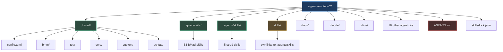
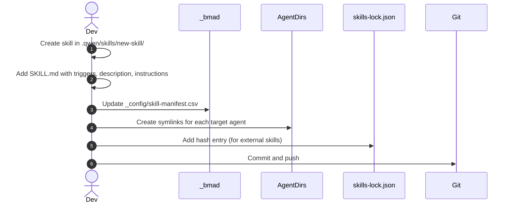

# Setup Guide

## Prerequisites

- **macOS** (primary development environment based on directory structure)
- **Git** for repository management
- One or more AI coding agents: Claude Code, Cline, Goose, Qwen, Roo, Trae, etc.
- **ICM CLI** (`icm`) for persistent memory (optional but recommended)

## Repository Structure


<!-- Sources: config.toml:1, _bmad/_config/manifest.yaml:1, skills-lock.json:1 -->

## Directory Quick Reference

| Path | Purpose | Citation |
|------|---------|----------|
| `.qwen/skills/` | Canonical BMad skill storage | (`_bmad/_config/skill-manifest.csv:1`) |
| `.agents/skills/` | Cross-agent shared skills (Stripe, etc.) | (`skills-lock.json:1`) |
| `skills/` | Symlinks to `.agents/skills/` for discoverability | (`skills/stripe-best-practices`) |
| `_bmad/` | BMad framework configuration and scripts | (`_bmad/config.toml:1`) |
| `docs/agile-context/` | Project documentation (PRD, architecture, UX) | (`docs/agile-context/project-brief.md`) |
| `docs/maestro/` | Maestro orchestration plans and state | (`docs/maestro/plans/`) |
| `.claude/skills/` | Claude Code agent skills (symlinked) | (`.claude/skills/bmad-create-prd/`) |
| `.cline/skills/` | Cline agent skills (symlinked) | (`.cline/skills/bmad-create-prd/`) |

## Initial Setup

### 1. Clone or Initialize

```bash
cd /path/to/aigency-router-v2
```

No build step is required — this is a content and configuration repository.

### 2. Verify Skill Manifest

```bash
cat _bmad/_config/skill-manifest.csv
```

This lists all 53 BMad skills with their directories. (`_bmad/_config/skill-manifest.csv:1`)

### 3. Verify Agent Symlinks

Ensure your target agent directories have valid symlinks:

```bash
ls -la .claude/skills/bmad-create-prd
# Should show: -> ../../.qwen/skills/bmad-create-prd
```

If symlinks are broken, recreate them:

```bash
ln -s ../../.qwen/skills/bmad-create-prd .claude/skills/bmad-create-prd
```

### 4. Configure ICM (Optional)

```bash
icm health
icm topics
```

See [AGENTS.md](../AGENTS.md) for ICM usage rules. (`AGENTS.md:1`)

### 5. Configure Custom Overrides

Create `_bmad/custom/config.user.toml` (gitignored) for personal agent overrides:

```toml
[agents.bmad-agent-dev]
name = "YourDevName"
description = "Your custom dev description"
```

(`_bmad/custom/config.user.toml:1`)

## Adding a New Skill


<!-- Sources: _bmad/_config/skill-manifest.csv:1, skills-lock.json:1, _bmad/scripts/resolve_config.py:1 -->

## Syncing Skills Across Agents

Use the provided configuration scripts to resolve and propagate skills:

```bash
python _bmad/scripts/resolve_config.py
python _bmad/scripts/resolve_customization.py
```

(`_bmad/scripts/resolve_config.py:1`, `_bmad/scripts/resolve_customization.py:1`)

## Validation Checklist

- [ ] All agent skill directories have valid symlinks
- [ ] `skills-lock.json` hashes match actual file contents
- [ ] `_bmad/_config/skill-manifest.csv` is up to date
- [ ] `AGENTS.md` is present in repository root
- [ ] ICM is configured (if using persistent memory)

## Troubleshooting

| Issue | Cause | Fix |
|-------|-------|-----|
| Agent can't find skill | Broken symlink | Recreate symlink relative to agent dir |
| Skill content outdated | Cached by agent | Restart agent or clear skill cache |
| Config not loading | Missing custom file | Ensure `_bmad/custom/config.user.toml` exists |
| ICM not working | CLI not installed | `pip install icm-cli` or check PATH |

## Related Pages

- [Quick Reference](./quick-reference.md) — Day-to-day commands and workflows
- [Skills System](../02-deep-dive/skills-system/index.md) — Deep dive into skill anatomy
- [Agent Platforms](../02-deep-dive/agent-platforms/index.md) — Per-agent setup details
