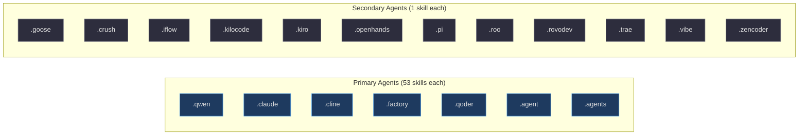
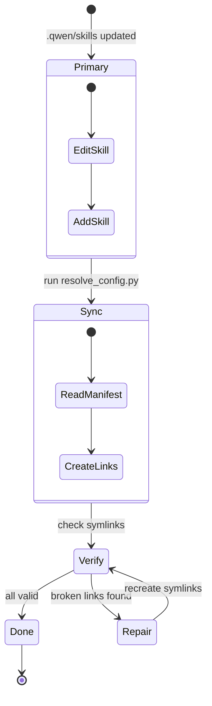

# Agent Platforms

Aigency Router v2 distributes skills to **18+ AI coding agent platforms** through a unified symlink model. This page documents the supported agents, directory conventions, and synchronization strategy.

## Supported Agents


<!-- Sources: _bmad/_config/files-manifest.csv:1, directory listing -->

## Agent Directory Convention

Each agent follows the pattern:

```
.{agent-name}/
└── skills/
    └── {skill-name}/ -> ../../.qwen/skills/{skill-name}
        └── SKILL.md
```

Example for Claude Code:
```
.claude/skills/bmad-create-prd -> ../../.qwen/skills/bmad-create-prd
```

(`.claude/skills/bmad-create-prd`)

## Platform Coverage Matrix

| Agent | Platform | Skills Count | Primary Use Case |
|-------|----------|-------------|------------------|
| **Qwen** | Qwen CLI / Kimi | 53 | Canonical skill store |
| **Claude** | Claude Code | 53 | Anthropic agent IDE |
| **Cline** | Cline VS Code | 53 | VS Code extension |
| **Factory** | Factory | 53 | AI coding platform |
| **Qoder** | Qoder | 53 | AI coding assistant |
| **Agent** | Generic agent | 53 | Fallback agent dir |
| **Agents** | Multi-agent | 56 | Shared + BMad skills |
| Goose | Goose CLI | 1 | Minimal integration |
| Crush | Crush | 1 | Minimal integration |
| iFlow | iFlow | 1 | Minimal integration |
| Kilocode | Kilocode | 1 | Minimal integration |
| Kiro | Kiro | 1 | Minimal integration |
| OpenHands | OpenHands | 1 | Minimal integration |
| Pi | Pi Agent | 1 | Minimal integration |
| Roo | Roo Code | 1 | Minimal integration |
| RovoDev | RovoDev | 1 | Minimal integration |
| Trae | Trae | 1 | Minimal integration |
| Vibe | Vibe | 1 | Minimal integration |
| Zencoder | Zencoder | 1 | Minimal integration |

(`_bmad/_config/files-manifest.csv:1`)

## Synchronization Strategy


<!-- Sources: _bmad/scripts/resolve_config.py:1, _bmad/_config/skill-manifest.csv:1 -->

## Per-Agent Notes

### Claude Code (`.claude/`)
- Reads `SKILL.md` files from `.claude/skills/`
- Also respects `.github/copilot-instructions.md` for GitHub Copilot
- Supports `AGENTS.md` in repository root for context

### Cline (`.cline/`)
- VS Code extension format
- Symlinks to `.qwen/skills/` for BMad skills

### Goose (`.goose/`)
- Minimal integration — only 1 skill currently
- Can be expanded by running `resolve_config.py`

### Zencoder (`.zencoder/`)
- Minimal integration
- Uses same symlink pattern as other agents

## Adding a New Agent Platform

1. Create `.newagent/skills/` directory
2. Run `python _bmad/scripts/resolve_config.py`
3. Verify symlinks: `ls -la .newagent/skills/`
4. Add agent to `_bmad/_config/files-manifest.csv`

## Related Pages

- [Skills System](../skills-system/index.md) — Skill structure and distribution
- [Architecture](../architecture/index.md) — System design overview
- [Setup](../../01-getting-started/setup.md) — Practical setup guide
