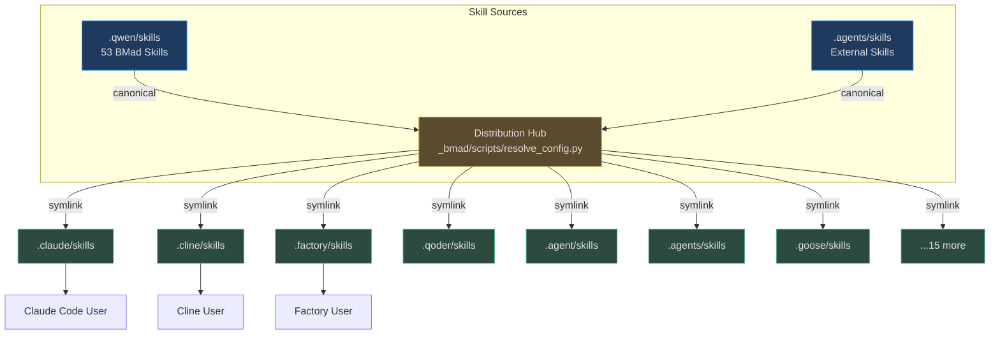
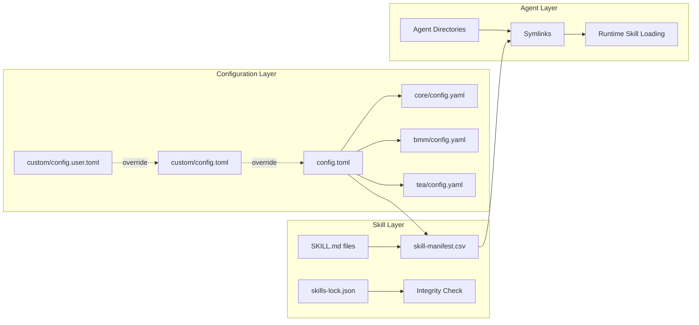
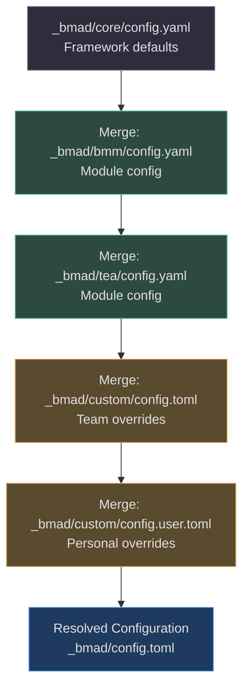
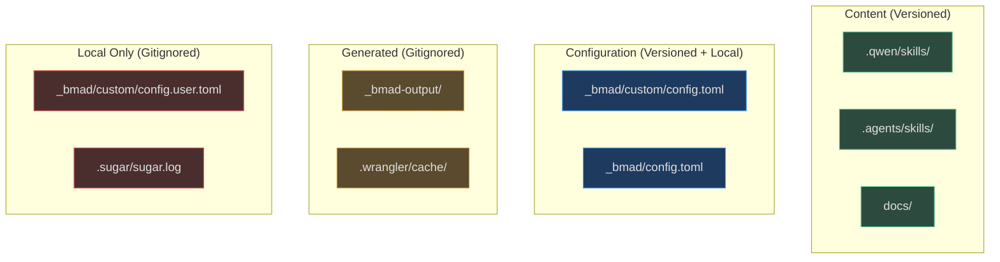

# System Architecture

Aigency Router v2 follows a **hub-and-spoke distribution model** with a canonical skill store, symlink-based replication, and configuration-driven agent orchestration.

## High-Level Architecture


<!-- Sources: _bmad/scripts/resolve_config.py:1, _bmad/_config/manifest.yaml:1, config.toml:1 -->

## Component Diagram


<!-- Sources: _bmad/config.toml:1, _bmad/core/config.yaml:1, _bmad/_config/skill-manifest.csv:1, skills-lock.json:1 -->

## Data Flow

```mermaid
sequenceDiagram
    autonumber
    actor User
    participant Agent as AI Agent (Claude/Cline/etc)
    participant Dir as Agent Skills Directory
    participant Link as Symlink Resolver
    participant Canon as Canonical Skill Store

    User->>Agent: "Run sprint planning"
    Agent->>Dir: Search for matching skill
    Dir->>Link: Resolve symlink
    Link->>Canon: Read .qwen/skills/bmad-sprint-planning/SKILL.md
    Canon-->>Link: Return skill content
    Link-->>Dir: Return resolved content
    Dir-->>Agent: Load skill instructions
    Agent-->>User: Execute sprint planning workflow
```
<!-- Sources: .qwen/skills/bmad-sprint-planning/SKILL.md:1, _bmad/scripts/resolve_config.py:1 -->

## Configuration Resolution Order


<!-- Sources: _bmad/scripts/resolve_config.py:1, _bmad/core/config.yaml:1, _bmad/custom/config.toml:1 -->

## Key Design Decisions

1. **Symlinks over copies**: Skills are symlinked, not copied, to ensure a single source of truth. (`_bmad/scripts/resolve_config.py:1`)
2. **Agent-agnostic storage**: The canonical store in `.qwen/skills/` is platform-neutral; agents read via symlinks. (`.qwen/skills/bmad-help/SKILL.md:1`)
3. **Hash locking**: External skills (Stripe) are SHA-256 hashed in `skills-lock.json` for supply chain security. (`skills-lock.json:1`)
4. **Layered config**: Configuration merges from framework defaults → module config → team overrides → personal overrides. (`_bmad/custom/config.user.toml:1`)

## Directory Boundary Map


<!-- Sources: .gitignore:1, _bmad/custom/.gitignore:1, _bmad/config.toml:1 -->

## Related Pages

- [Skills System](../skills-system/index.md) — Skill anatomy and distribution mechanics
- [Agent Platforms](../agent-platforms/index.md) — Per-agent integration details
- [BMad Framework](../bmad-framework/index.md) — Module and persona architecture
