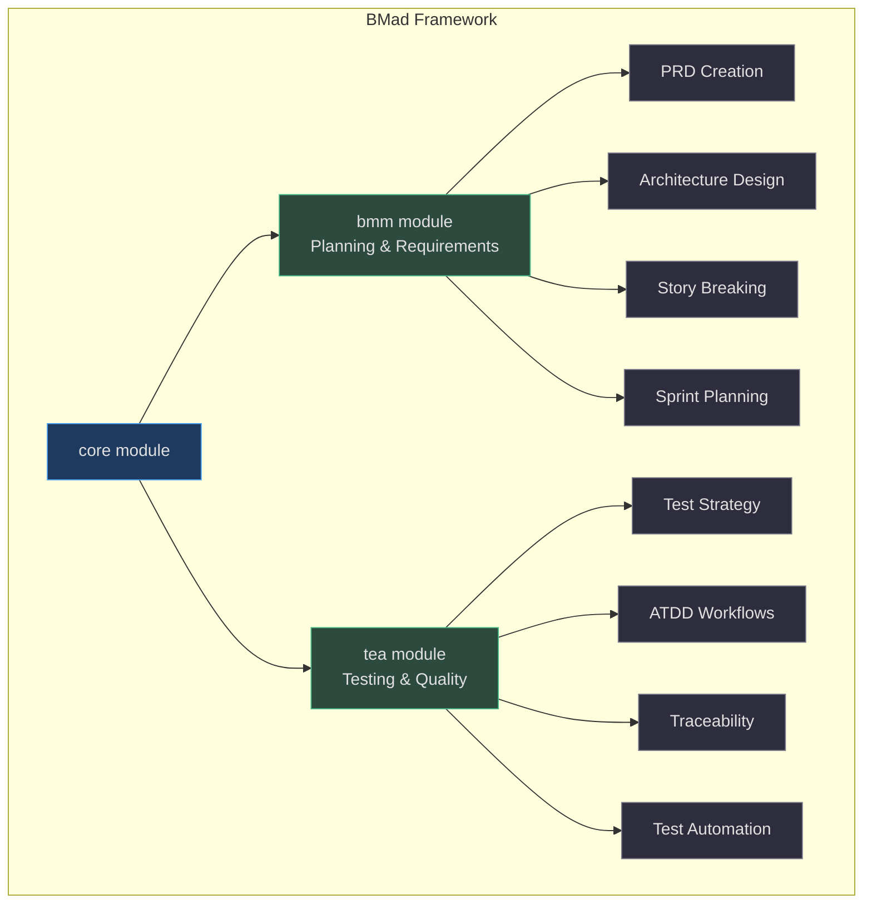
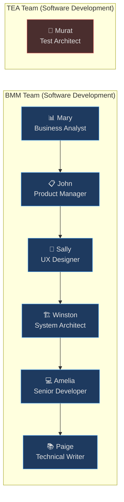
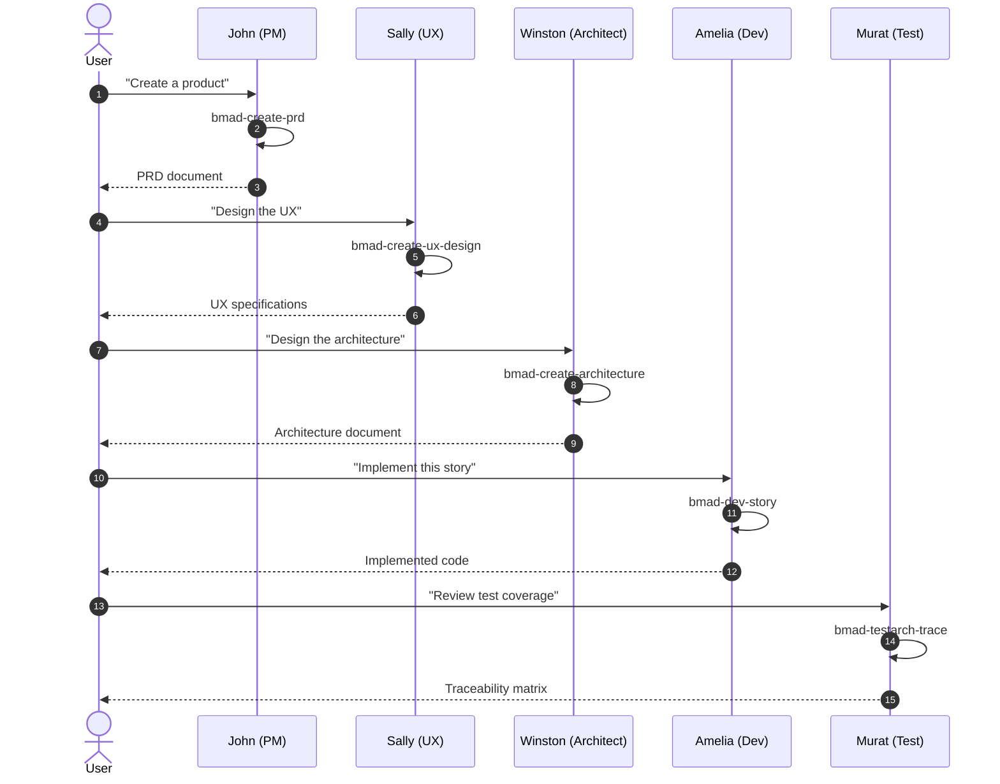
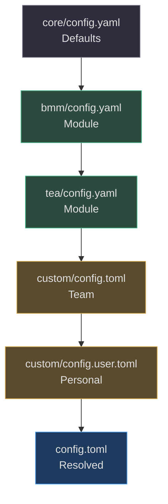

# BMad Framework

The **Business Modeler & Developer (BMad)** framework is the foundational orchestration layer of Aigency Router. It defines agent personas, modules, workflows, and artifact generation for the full software development lifecycle.

## Framework Structure

<!-- Sources: _bmad/core/config.yaml:1, _bmad/bmm/config.yaml:1, _bmad/tea/config.yaml:1 -->

## Agent Personas

BMad defines 7 specialized agent personas, each with a name, title, icon, and communication style:

<!-- Sources: config.toml:35-70 -->

### Persona Details

| Persona | Name | Module | Communication Style | Citation |
|---------|------|--------|---------------------|----------|
| Analyst | Mary | BMM | "Treasure hunter narrating the find — thrilled by clues, precise once pattern emerges" | (`config.toml:40-43`) |
| Tech Writer | Paige | BMM | "Patient teacher using analogies that make complex things feel simple" | (`config.toml:45-48`) |
| PM | John | BMM | "Detective interrogating a cold case — short questions, sharper follow-ups" | (`config.toml:50-53`) |
| UX Designer | Sally | BMM | "Filmmaker pitching the scene before code exists, painting user stories" | (`config.toml:55-58`) |
| Architect | Winston | BMM | "Seasoned engineer at whiteboard — measured, laying out trade-offs" | (`config.toml:60-63`) |
| Developer | Amelia | BMM | "Terminal prompt — exact file paths, AC IDs, commit-message brevity" | (`config.toml:65-68`) |
| Test Architect | Murat | TEA | "Risk calculations and impact assessments; strong opinions, weakly held" | (`config.toml:70-73`) |

## Module Configuration

### Core Module

The core module provides framework-wide defaults:
- Project name resolution
- Output folder paths
- Language settings

(`_bmad/core/config.yaml:1`)

### BMM Module

The Business Modeler & Manager module handles planning:
- `planning_artifacts`: `_bmad-output/planning-artifacts`
- `implementation_artifacts`: `_bmad-output/implementation-artifacts`
- `project_knowledge`: `docs/`

(`_bmad/bmm/config.yaml:1`, `_bmad/config.toml:12-15`)

### TEA Module

The Test Engineering & Assurance module handles quality:
- `test_artifacts`: `_bmad-output/test-artifacts`
- `test_stack_type`: `auto`
- `ci_platform`: `auto`
- `risk_threshold`: `p1`
- `tea_use_playwright_utils`: `true`

(`_bmad/tea/config.yaml:1`, `_bmad/config.toml:17-30`)

## Workflow: PRD to Implementation

<!-- Sources: .qwen/skills/bmad-create-prd/SKILL.md:1, .qwen/skills/bmad-create-ux-design/SKILL.md:1, .qwen/skills/bmad-create-architecture/SKILL.md:1, .qwen/skills/bmad-dev-story/SKILL.md:1, .qwen/skills/bmad-testarch-trace/SKILL.md:1 -->

## Configuration Resolution

<!-- Sources: _bmad/scripts/resolve_config.py:1, _bmad/core/config.yaml:1 -->

## Related Pages

- [Skills System](../skills-system/index.md) — How BMad skills are structured
- [Architecture](../architecture/index.md) — System design overview
- [Agent Platforms](../agent-platforms/index.md) — Where personas execute
