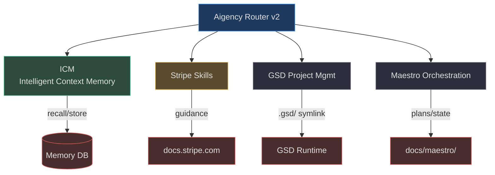
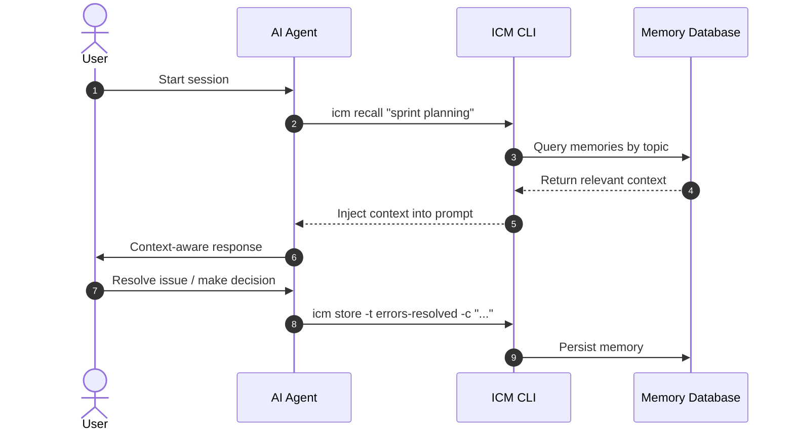

# Integrations

Aigency Router v2 integrates with external systems for memory persistence, payment processing guidance, and project management. This page documents each integration's purpose, configuration, and data flow.

## Integration Overview


<!-- Sources: AGENTS.md:1, skills-lock.json:1, .gsd symlink, docs/maestro/ -->

## ICM (Intelligent Context Memory)

ICM provides persistent memory across AI agent sessions. It is mandatory for all work in this repository.

### Data Flow


<!-- Sources: AGENTS.md:1, .github/copilot-instructions.md:1 -->

### Mandatory Store Triggers

| Trigger | Command Example | Citation |
|---------|----------------|----------|
| Error resolved | `icm store -t errors-resolved -c "fixed N+1 query"` | (`AGENTS.md:14`) |
| Architecture decision | `icm store -t decisions-aigency -c "chose symlink model"` | (`AGENTS.md:17`) |
| User preference | `icm store -t preferences -c "uses dark theme"` | (`AGENTS.md:18`) |
| Task completed | `icm store -t context-aigency -c "finished wiki gen"` | (`AGENTS.md:19`) |
| 20+ tool calls | Store progress summary | (`AGENTS.md:20`) |

## Stripe Skills

Three Stripe-related skills provide payment processing guidance:

| Skill | Source | Hash | Purpose |
|-------|--------|------|---------|
| `stripe-best-practices` | docs.stripe.com | `f0aac866...` | API selection, Connect, webhooks |
| `stripe-projects` | docs.stripe.com | `74b5f9e1...` | Projects CLI setup |
| `upgrade-stripe` | docs.stripe.com | `df1c52c1...` | API version migration |

(`skills-lock.json:1`)

These skills are stored in `.agents/skills/` and symlinked to `skills/` for discoverability. They are **read-only guidance skills** — they do not contain API keys or secrets.

### Skill Integrity Verification

```bash
# Verify hash matches
sha256sum skills/stripe-best-practices/SKILL.md
# Compare with skills-lock.json
```

## GSD (Get Stuff Done)

GSD is a project management framework integrated via symlink:

```
.gsd -> /Users/antonioreid/.gsd/projects/57b4f38c4bd3
```

(`.gsd`)

This links the repository to a GSD workspace for:
- Sprint tracking
- Phase planning
- Task management
- Context preservation across sessions

The `.gsd-id` file stores the project identifier:
```
57b4f38c4bd3
```

(`.gsd-id:1`)

## Maestro Orchestration

Maestro manages multi-agent orchestration plans and state:

```
docs/maestro/
├── plans/     # Orchestration plans
└── state/     # Runtime state
```

(`docs/maestro/`)

## BMad Output Artifacts

Generated artifacts are stored in `_bmad-output/`:

```
_bmad-output/
├── implementation-artifacts/   # Code, configs, migrations
├── planning-artifacts/         # PRDs, architectures, stories
└── test-artifacts/             # Test plans, traces, reviews
```

(`_bmad/config.toml:10`)

## Related Pages

- [BMad Framework](../bmad-framework/index.md) — Framework internals
- [Setup](../../01-getting-started/setup.md) — Configuration details
