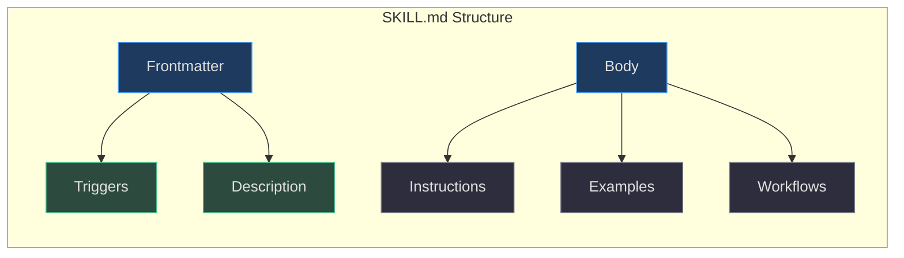
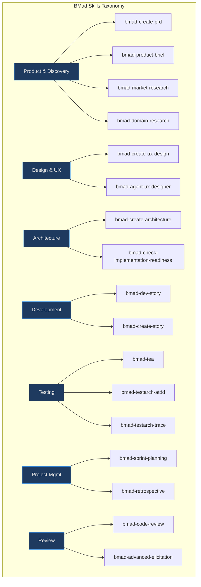
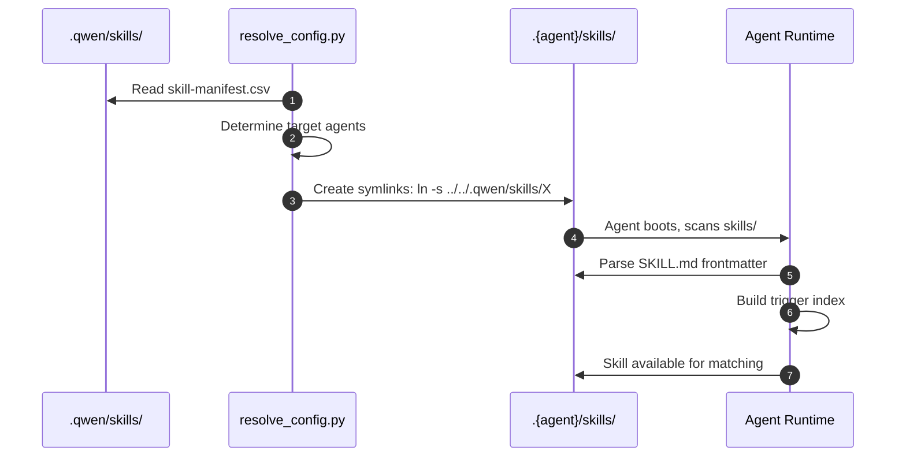

# Skills System

The skills system is the core capability of Aigency Router. It defines how skills are structured, stored, versioned, discovered, and distributed to agent platforms.

## Skill Anatomy

Every skill is a self-contained directory following this structure:

```
skill-name/
├── SKILL.md          # Required: triggers, description, instructions
├── scripts/          # Optional: helper scripts
├── resources/        # Optional: templates, assets
├── prompts/          # Optional: prompt templates
├── steps-v/          # Optional: verification steps
├── steps-c/          # Optional: creation steps
└── steps-e/          # Optional: execution steps
```

(`_bmad/_config/skill-manifest.csv:1`, `.qwen/skills/bmad-create-prd/SKILL.md:1`)

## SKILL.md Format


<!-- Sources: .qwen/skills/bmad-create-prd/SKILL.md:1, .qwen/skills/bmad-dev-story/SKILL.md:1 -->

### Example Frontmatter

```yaml
---
name: bmad-create-prd
description: Create a PRD from scratch. Use when the user says...
triggers:
  - create a prd
  - product requirements document
  - write a prd
---
```

(`.qwen/skills/bmad-create-prd/SKILL.md:1`)

## Skill Categories


<!-- Sources: _bmad/_config/skill-manifest.csv:1, _bmad/_config/files-manifest.csv:1 -->

## Distribution Model

Skills flow from canonical stores to agent directories through symbolic links:


<!-- Sources: _bmad/scripts/resolve_config.py:1, _bmad/_config/skill-manifest.csv:1 -->

## Skill Integrity

External skills (not BMad-native) are tracked in `skills-lock.json`:

```json
{
  "skills": {
    "stripe-best-practices": {
      "source": "docs.stripe.com",
      "sourceType": "well-known",
      "computedHash": "f0aac866fab408c8bf28f3acacbbf61539cea81b3aeb030fceb64be1ccddaf9e"
    }
  }
}
```

(`skills-lock.json:1`)

This enables:
- **Tamper detection**: Hash mismatch indicates modification
- **Provenance tracking**: Source URL for audit trails
- **Update validation**: New versions require explicit hash update

## Skill Manifest

The manifest at `_bmad/_config/skill-manifest.csv` maps skill IDs to directories and metadata:

| Field | Purpose | Example |
|-------|---------|---------|
| `skill_id` | Unique identifier | `bmad-create-prd` |
| `directory` | Relative path | `.qwen/skills/bmad-create-prd` |
| `category` | BMad module | `bmm` or `tea` |
| `agent` | Primary agent persona | `bmad-agent-pm` |

(`_bmad/_config/skill-manifest.csv:1`)

## Adding a New Skill

1. Create directory in `.qwen/skills/{skill-name}/`
2. Write `SKILL.md` with frontmatter, triggers, and instructions
3. Add entry to `_bmad/_config/skill-manifest.csv`
4. Run `python _bmad/scripts/resolve_config.py` to propagate symlinks
5. Commit changes

## Related Pages

- [Architecture](../architecture/index.md) — How skills fit into the system
- [Agent Platforms](../agent-platforms/index.md) — How agents consume skills
- [Setup](../../01-getting-started/setup.md) — Practical skill installation
