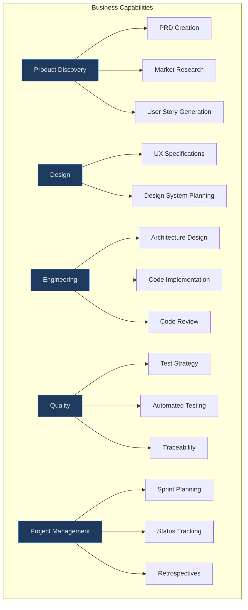

# Executive Guide

## What Is Aigency Router v2?

Aigency Router v2 is a **centralized skill management system** for AI coding agents. It enables organizations to standardize how AI assistants perform software development tasks across multiple tools and teams.

## Capability Map

<!-- Sources: _bmad/_config/skill-manifest.csv:1, config.toml:1 -->

## Scale Metrics

| Metric | Value | Significance |
|--------|-------|-------------|
| **53 skills** | Cover full SDLC | One library replaces scattered prompts |
| **18 agent platforms** | Tool-agnostic | No vendor lock-in |
| **7 agent personas** | Role specialization | Quality matching expertise to task |
| **0 build time** | Content repository | Instant updates, no CI/CD pipeline |
| **Hash-locked externals** | Supply chain security | Tamper-evident skill integrity |

## Investment Thesis

### Why This Matters

AI coding tools are proliferating — Claude, Cline, Goose, Copilot, and dozens more. Each tool has its own prompt format, conventions, and limitations. Without a router:

- Teams rewrite the same prompts for different tools
- Quality varies by individual prompt engineering skill
- Best practices (Stripe integration, security reviews) are tribal knowledge
- Context is lost between sessions and tools

Aigency Router solves this by treating **skills as reusable assets** distributed to any tool.

### Risk Assessment

| Risk | Likelihood | Impact | Mitigation |
|------|-----------|--------|------------|
| Agent platform breaks skill format | Medium | High | Skill format is markdown — widely supported |
| Skill content becomes outdated | High | Medium | Versioned via git; hash-locking for externals |
| Symlink management scales poorly | Low | Medium | 53 skills × 18 agents = ~954 links; script-managed |
| Team doesn't adopt ICM | Medium | High | `AGENTS.md` mandates it; enforced by conventions |

## Organizational Fit

### Who Benefits

- **Engineering teams** using multiple AI tools
- **Consultancies** delivering consistent quality across client projects
- **Enterprises** needing governance over AI-generated outputs
- **Startups** wanting to accelerate from idea to production

### Integration Requirements

No infrastructure required. The router is a git repository that lives alongside your code. Agents read skills directly from the filesystem.

## Roadmap Indicators

The repository contains scaffolding for future capabilities:

- `docs/maestro/` — Multi-agent orchestration plans
- `docs/agile-context/` — Project documentation templates
- `_bmad-output/` — Artifact generation directories
- `.gsd` symlink — Project management integration

## Related Pages

- [Product Manager Guide](./product-manager.md) — Feature overview from PM perspective
- [Overview](../01-getting-started/overview.md) — Technical introduction
