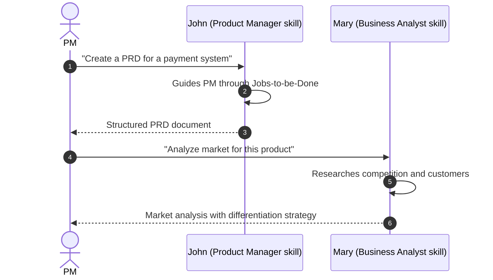
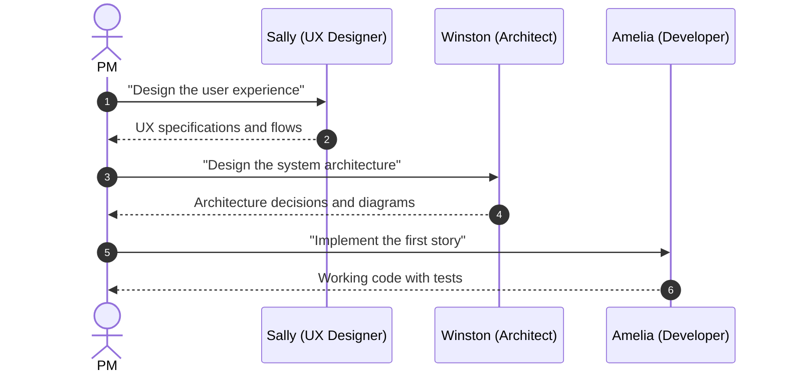
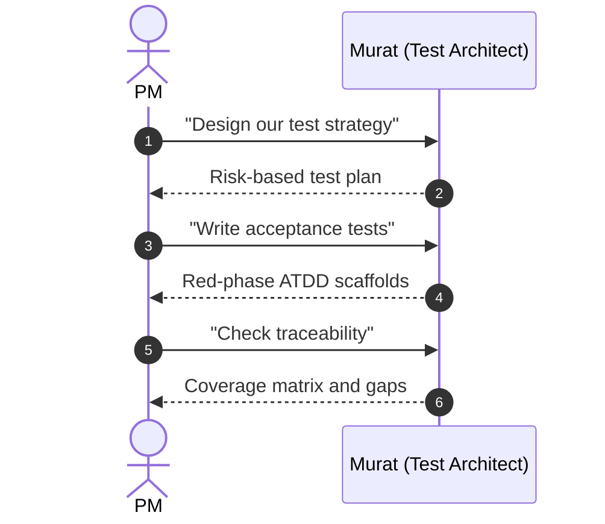

# Product Manager Guide

## What You Can Do With Aigency Router

Aigency Router gives your AI coding assistants a library of **playbooks** for software development. Instead of typing detailed instructions every time, you invoke a skill by name.

## User Journeys

### Journey 1: From Idea to Product Requirements

<!-- Sources: .qwen/skills/bmad-create-prd/SKILL.md:1, .qwen/skills/bmad-market-research/SKILL.md:1 -->

### Journey 2: From PRD to Working Software

<!-- Sources: .qwen/skills/bmad-create-ux-design/SKILL.md:1, .qwen/skills/bmad-create-architecture/SKILL.md:1, .qwen/skills/bmad-dev-story/SKILL.md:1 -->

### Journey 3: Quality Assurance

<!-- Sources: .qwen/skills/bmad-tea/SKILL.md:1, .qwen/skills/bmad-testarch-atdd/SKILL.md:1, .qwen/skills/bmad-testarch-trace/SKILL.md:1 -->

## Feature Overview

| Feature | What It Does | When You Need It |
|---------|-------------|-----------------|
| **PRD Creation** | Structured product requirements with JTBD | Starting a new feature |
| **UX Design** | User flows, patterns, specifications | Designing interfaces |
| **Architecture** | System design with trade-off analysis | Technical planning |
| **Story Creation** | Break epics into implementable stories | Sprint planning |
| **Code Review** | Adversarial review with triage | Before merging code |
| **Sprint Planning** | Status tracking and risk surfacing | Weekly rituals |
| **Retrospectives** | Post-epic lessons extraction | After shipping |

## Limitations

- **No hosted UI**: This is a configuration repository, not a web application. You interact with it through AI agent tools.
- **Requires agent setup**: Each team member needs an AI coding agent that supports skill loading.
- **Markdown-only skills**: Skills are text files. They cannot execute code or call APIs directly.
- **No real-time sync**: Skill updates require restarting the agent or reloading skills.

## How to Request a New Skill

1. Describe the workflow you want automated
2. Identify trigger phrases (what users will say to activate it)
3. Provide example inputs and expected outputs
4. Assign to the appropriate agent persona (John for product, Winston for architecture, etc.)

## Glossary

| Term | Simple Definition |
|------|-------------------|
| **Skill** | A playbook that teaches an AI assistant how to do a specific task |
| **Agent** | An AI coding tool like Claude Code or Cline |
| **Persona** | A named role (like "John the PM") with specific expertise |
| **BMad** | The framework that organizes skills and personas |
| **Symlink** | A shortcut that lets multiple agents share one copy of a skill |

## Related Pages

- [Overview](../01-getting-started/overview.md) — High-level introduction
- [Executive Guide](./executive.md) — Strategic context and ROI
